# Introduction

Postman provides an API Client to test and experiment with API requests among other
things. It provides both a web interface and desktop clients for multiple operating systems.

This guide demonstrates how to setup Postman to test API requests.

# Create a Postman Account

If you do not have a Postman account, browse to [www.postman.com](https://www.postman.com/)
and sign up. Signing up is free, and you don't have to pay anything to test our API's.

The steps to sign up is as follows:

1. Create a new Account or sign up with Google:

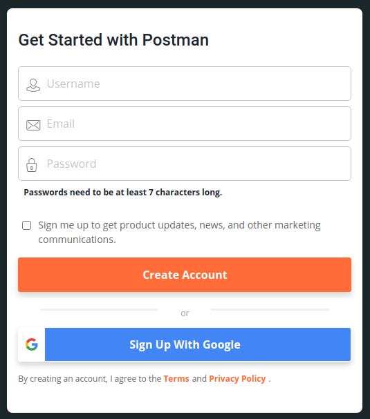

2. After creating your account or signing up, you will see a **Welcome to Postman** screen. 
   You can enter your name if you want, but selecting any of the additional options are
   not required:

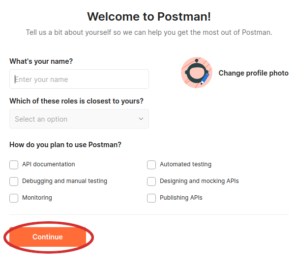

3. Next you will be asked to create your own team, this is also not required, and you may
   select **Continue Without a Team**:
   
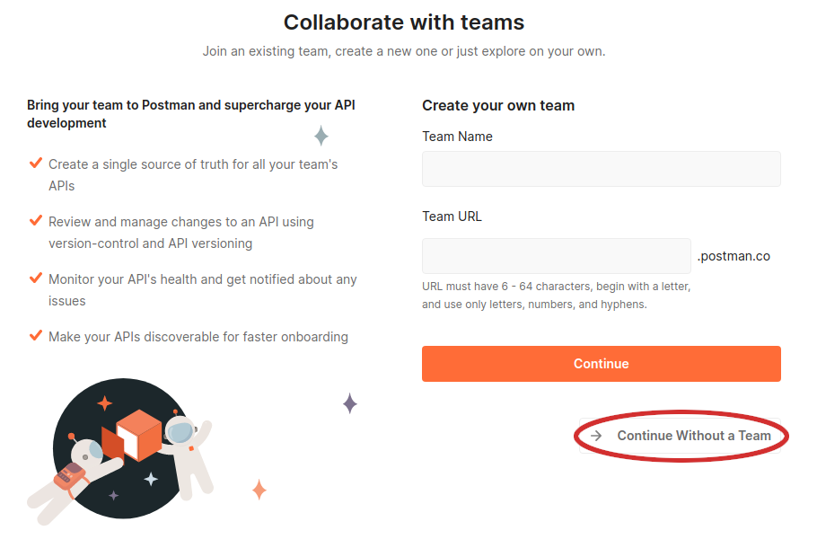

4. Once done, you will be launched into the Postman web application and should see a screen
   like the one below:

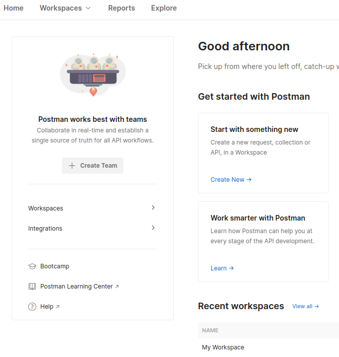

# Postman Terminology and Initial Setup

> At this point of the guide you may continue using either the Postman web 
> application, or the Desktop application as they are functionally the same.

Postman has a number of terms that you should get familiar with. Let's dive right in:

## Workspaces

[Workspaces](https://learning.postman.com/docs/collaborating-in-postman/using-workspaces/creating-workspaces/)
allow you to organize your Postman work. Your default workspace is called **My Workspace**
and for a start you can work under the default workspace. To do this, select **My Workspace**
from the top menu:

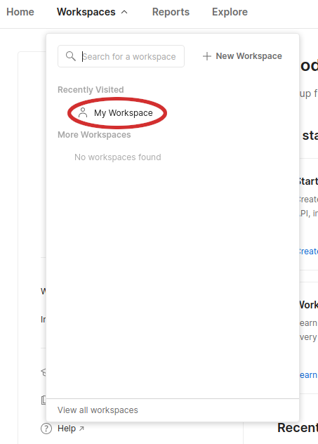

After selecting the workspace you will see something like this:

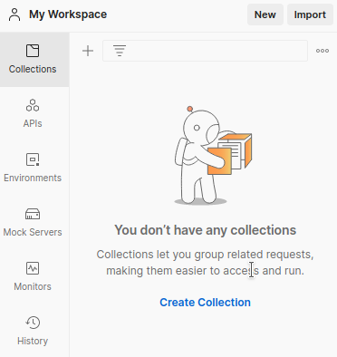

## Collections

[Collections](https://learning.postman.com/docs/sending-requests/intro-to-collections/) 
are like folders with which to organize API requests. In our case we have 4 sets of 
Collections for the Destiny platform, namely:

* Destiny HTTP API Quick Start Guide
* Destiny HTTP API 
* Destiny HTTP History Query API
* Destiny SSE Guide.

Each of these collections may contain numerous API Requests.

> At this point in the guide you won't have any collections if you've 
> just created your Postman account.

## Environments

[Environments](https://learning.postman.com/docs/sending-requests/managing-environments/) allow you to configure common variables to be used when making API requests.
A good example is to use Environment variables such as your username and password and the
domain you'd like to access when testing API requests.

> At this point in the guide you won't have any environments if you've
> just created your Postman account.

# Adding Your First Collection

We can now finally add one of the Destiny Postman Collections to your workspace. 

> Throughout this document you will find links to Destiny Postman Collections but 
> for your convenience they are listed below.

When you click on any of the links below you will be taken to the corresponding
public documentation for that collection. For a start, open this link
on a new tab in your browser: [Destiny HTTP API Quick Start Guide Collection](https://documenter.getpostman.com/view/217817/TzRLnWoy). 
Once the page have opened you should see something like this:

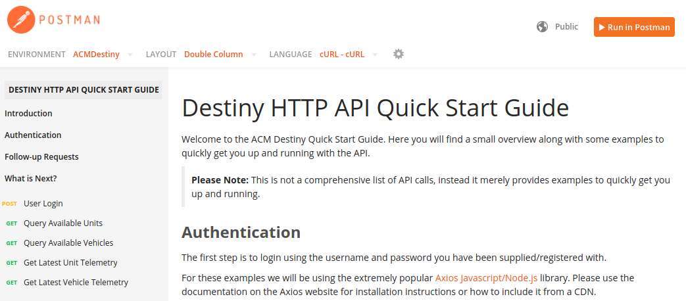

Before you do anything else, select the Environment we have created for you. You can also
pick between different languages to show the API request examples.

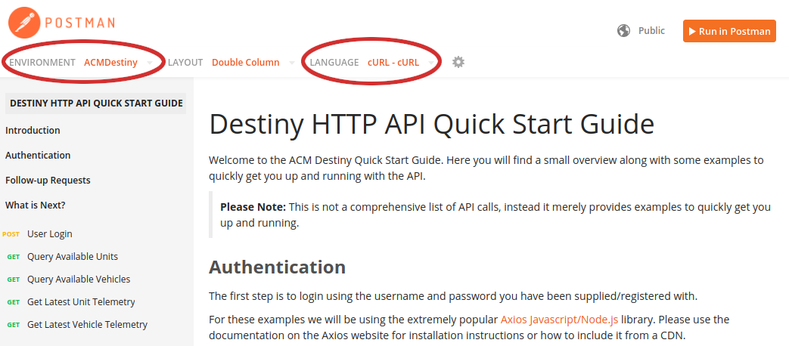

Scroll down and take a look at some example requests in this collection. Finally, you can
make your own personal copy of the collection by clicking on the 
**Run in Postman** button.

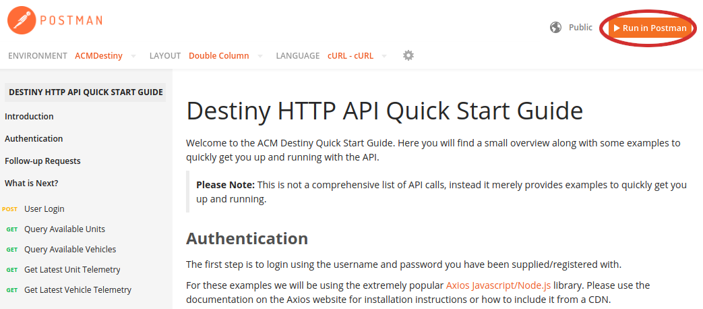

Next, you will be asked where to run the collection. If you've already downloaded the
desktop application select **Postman for Windows** or **Postman for Linux** or whichever
operating system you are using. Alternatively you can select **Postman for Web** to not
use the desktop application.

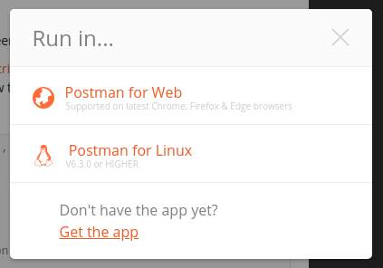

> **Important!** Whether you select **Postman for Web** or not, a copy of the Collection
> and the Environment will be made into your *Workspace*. If you end up with duplicate
> Collections and/or Environments, just delete the extras. 

Below is a link for each of the 4 Destiny Postman Collections:

* [Destiny HTTP API Quick Start Guide Collection](https://documenter.getpostman.com/view/217817/TzRLnWoy)
* [Destiny HTTP API Collection](https://documenter.getpostman.com/view/217817/TzRLnWp3)
* [Destiny History Query API Collection](https://documenter.getpostman.com/view/217817/TzRLnWp8)
* [Destiny SSE Guide Collection](https://documenter.getpostman.com/view/217817/TzRLnWp4)

# Setting Up Your Environment

If you've added the collections to your *Workspace*, you will have one or more Environments
under the Environments tab. Click on the **ACMDestiny** environment to view the available
variables within that environment:

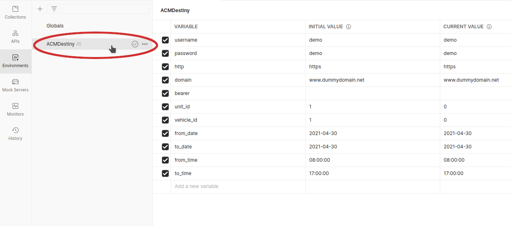

If you have more than one Environment called **ACMDestiny**, skip the first one and for
each of the rest, hover over the environment's name, click on the `...` (ellipses) button 
next to the environment name, and then click `Delete` on the dropdown menu:

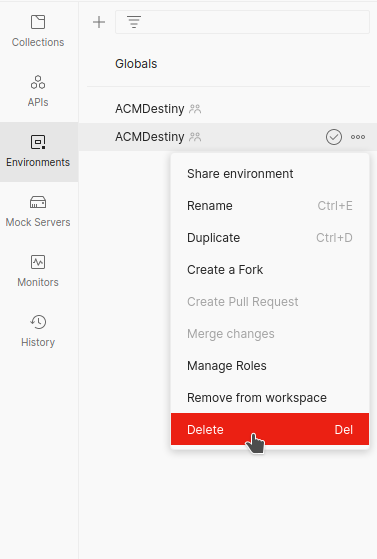

Finally, fill in the `username`, `password` fields under the `CURRENT VALUE` column . 
We will supply you with the `domain` if we haven't already done so. Once you have 
filled in these 3 fields, click on the Save button at the top right of the screen.

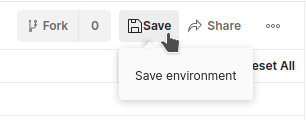

# Running Your First Request

Within Postman, click on the **Collections** button, and then click on the
**Destiny HTTP Quick Start Guide** collection.

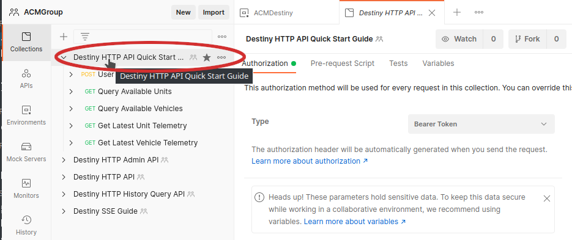

Now make sure the correct Environment is selected. At the top right of the screen you
may see a dropdown which says: `No Environment`. Click on the dropdown and select:
`ACMDestiny`.

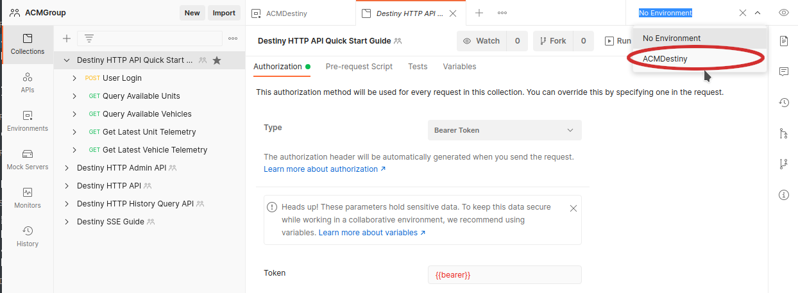

Click on the **POST User Login** request.

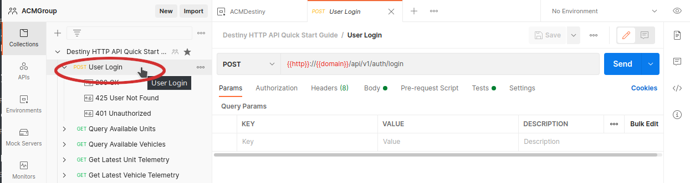

Next click on the **Send** button.

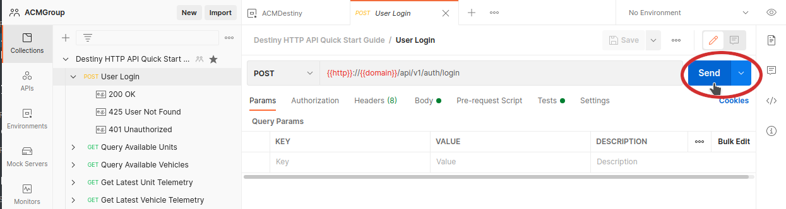

If you have the correct Environment selected as explained above, and you have the
correct username, password and domain in the Environment variables, the results
of the request will be displayed on the lower half of the screen.

Let's take a look at some of the available functionality in Postman. To see the
Body of the outgoing request, open the Body tab just below the url of the request:

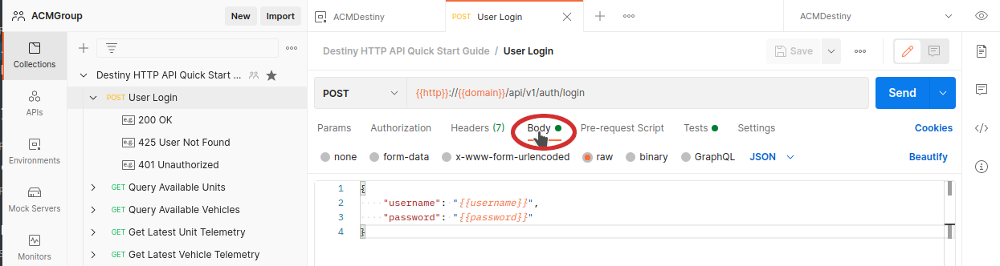

To look at the documentation for the **Request** or **Collection** click on the
**Documentation** toolbar button on the right side of the page:

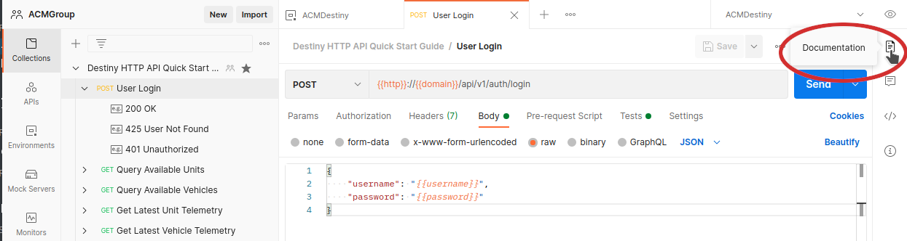

To close the documentation click on the X at the top right side of the documentation
panel:

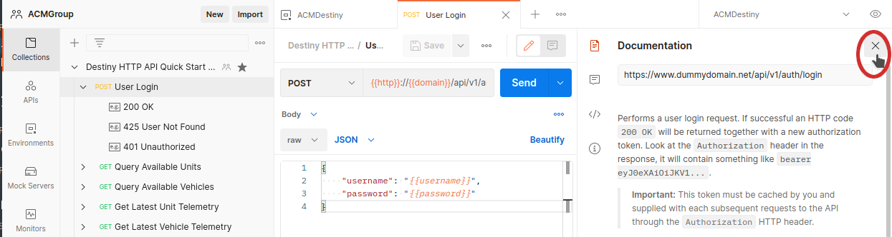

> **About Logins!** After you have sent the login request and received a successful
> response, all other requests will automatically use the login token. If your
> token eventually expires, simply do another User Login request.

# Final Words

While there is plenty more to learn about Postman and the available requests we
recommend that you read through the Postman documentation to find out more about
its functionality.
