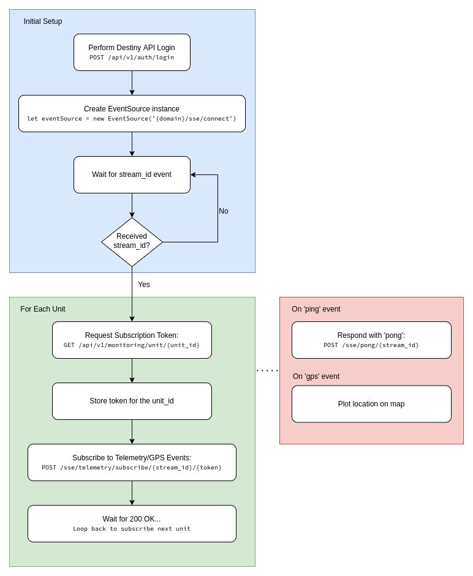

# Welcome to this guide!

The purpose of the guide is to instruct you on how to receive live telemetry messages in near-real time via server push technology, saving you from having to poll for the latest data.

One way to receive live messages from units/vehicles is through using SSE (Server-sent Events).

Here is a small extract from [Wikipedia](https://en.wikipedia.org/wiki/Server-sent_events):

> Server-Sent Events is a standard describing how servers can initiate data transmission towards clients once an initial client connection has been established. They are commonly used to send message updates or continuous data streams to a browser client and designed to enhance native, cross-browser streaming through a JavaScript API called EventSource, through which a client requests a particular URL in order to receive an event stream.

Please read the [MDN Web Docs on SSE](https://developer.mozilla.org/en-US/docs/Web/API/Server-sent_events/Using_server-sent_events), it supplies valuable information you need to know.

# Q & A

Before we kick of things lets answer some common questions:

1. What happens if the connection closes due to technical issues?

When using a browser the connection is restarted automatically. If you are not using the API through a browser but through a 3'rd party client please make sure it does the same.

2. How many connections can be made? Do I need to make a connection for every unit/vehicle I want to monitor?

SSE browser clients can only make 6 connections in total (and the limitation is shared across tabs), however, you only need one connection as you can monitor multiple units and vehicles over a single connection.

3. Does this work like Websockets?

Unlike Websockets, SSE is uni-directional, meaning that you can only receive data from it. However, subscriptions to monitor specific units/vehicles are done through our standard HTTP API.

4. Why can't I use Websockets instead?

Websocket integration will be coming in the future.

5. Will the connection remain active automatically?

The SSE server will send 'ping' events which you must answer back with a 'pong' through our HTTP API. This is explained further down in the guide.

6. How many units / vehicles can I monitor like this at the same time?

You can potentially monitor 100's of units / vehicles using SSE. That being said, the use case for this leans towards front-end live monitoring by individual users on their web browsers, phones or tablets, where a user selects a vehicle or unit to view, and the subscription is then made. For high volume traffic and data recording please contact ACMGroup for further details.

# Other SSE 3'rd Party Clients

Although SSE is mostly used between web browsers and servers, most programming languages have SSE clients with which you can implement the same functionality. See some of the reference materials below:

- [Javascript / Web API's](https://developer.mozilla.org/en-US/docs/Web/API/Server-sent_events/Using_server-sent_events)
- [Java Spring 5 WebFlux](https://www.baeldung.com/spring-server-sent-events)
- [C# Server Events Clients](https://docs.servicestack.net/csharp-server-events-client)
- [Python Flask-SSE](https://pypi.org/project/Flask-SSE/)
- [PHP php-sse-react](https://github.com/clue/php-sse-react)

...and many more, see the above linked Wikipedia page for more languages/libraries.

# Before You Continue

Make sure that you understand how to login to our HTTP API using the Login requests. Read our Destiny API Quick Start Guide for more information. This section assumes you have already logged in to the system.

The examples shown below uses Javascript and the popular [Axios Javascript/Node.js](https://axios-http.com/) library along with the standard Javascript SSE (EventSource) API.

# SSE Flow Diagram

This diagram shows the typical process of making a connection, getting a stream_id and then subscribing to units.



# Step 1: Make an SSE Connection

To start, we need to make an SSE connection to handle data events for all units/vehicles we will subscribe to.

```javascript

// Create a constant of the domain we'll be using
const url = `https://www.dummydomain.net`

// The SSE server will send us a stream_id soon after our connection
// have been established. We will need this before we can start 
// subscribing to specific units/vehicles.
let stream_id

// Make the initial connection
// IMPORTANT: Your SSE client will automatically try and reconnect if 
// the connection drops at some point in the future.
let eventSource = new EventSource(
  encodeURI(`${url}/sse/telemetry/connect`)
)

// The onopen event will be called if the connection was successful.
eventSource.onopen = () => {
  console.log(`SSE: EventSource connection successful!`)
}

// The onerror event will be called if the connection was unsuccessful
// or some other error occurred.
eventSource.onerror = (err) => {
  console.log(err)
}

// This is where we handle events
eventSource.onmessage = (event) => {
  // Convert the event data to JSON
  const data = JSON.parse(event.data)

  switch (data.type) {
    case 'stream_id':
      console.log(`SSE Event: stream_id received: ${data.stream_id}`)
      // Keep our stream_id for later use
      stream_id = data.stream_id
      break

    case 'ping':
      console.log('SSE Event: ping received')
      // Send back a pong through the HTTP API, include our
      // previously received stream_id
      axios.post(`${url}/sse/telemetry/pong/${stream_id}`)
      break

    case 'gps':
      console.log('SSE Event: gps or trip message received')
      
      const message = event.data
      if (message.message_type === 'gps') {
        // Log out the latitude and longitude
        console.log(`lat: ${message.telemetry.gps.latitude}, lng: ${message.telemetry.gps.longitude}`)
        
        // Or log out the full message
        // console.log(message)
      }
      break

    default:
      console.error('SSE: Unknown SSE event type: ' + data.type)
  }
}
```

# Step 2: Wait for the stream_id to be set

```javascript
  // One of the EventSource events is a 'stream_id' that the
  // server sends us, we set it above the moment we receive it.
  // Here we wait for the stream_id to be set...
  let time = 5000
  let interval = setInterval(() => {
  if (stream_id !== undefined && stream_id !== null) {
    // ... [STEP 3 CODE WILL GO HERE]
  }

  time -= 50
  if (time < 0) {
    clearInterval(interval)
  }
}, 50)
```

# Step 3: Subscribe to a Unit

Now that we have an SSE connection, we have to request a subscription token for the unit we want to subscribe to from the HTTP API, once we have that we can finally subscribe to a specific unit. As soon as a unit transmits a new message, we will receive it here.

Note that the code below must go into the part that says `... [STEP 3 CODE WILL GO HERE]` above...

```javascript
const unitId = 1 // Change this to the id of the unit you want to monitor.

// First request a token for the subscription from the HTTP API
axios.get(`${url}/api/v1/monitoring/unit/${unitId}`)
  .then((response) => {
    // Tip: You may want to keep the token for each unit you 
    // have subscribed to as each token is unique to the unit 
    // you have subscribed to.
    const subscription = response.data.data
    
    // Now that we have a token for the unit, we can subscribe to it
    axios.post(`${url}/sse/telemetry/subscribe/${stream_id}/${subscription.token}`)
})
```

In order to request a subscription token for a vehicle instead of a unit, use
`/api/v1/monitoring/vehicle/${vehicleId}/primary` instead of
`/api/v1/monitoring/unit/${unitId}`

# Quick Tips

To unsubscribe from a unit/vehicle do the following:

```javascript
axios.post(`${url}/sse/telemetry/unsubscribe/${stream_id}/${subscription.token}`)
```

To disconnect from the SSE server do the following:

```javascript
eventSource.close()
```

# Full Example

View a more modern [HTML/Javascript example here](SSE/UnitSubscribeExample.html). The example shows how you can access our SSE service using a combination of the popular 
[Axios Javascript/Node.js](https://axios-http.com/) library together with the 
browser's built-in SSE support called EventSource.

> IMPORTANT: The example page does not show anything on the browser window, 
> instead, everything is logged to the browser's console.

# What is Next?

As this guide demonstrated, you can easily establish an SSE connection, then through executing steps 2 and/or 3 you can subscribe to a number of units and vehicles using the same steps over and over.

You may want to take a look at our History / Telemetry Query API next (*coming soon*).
